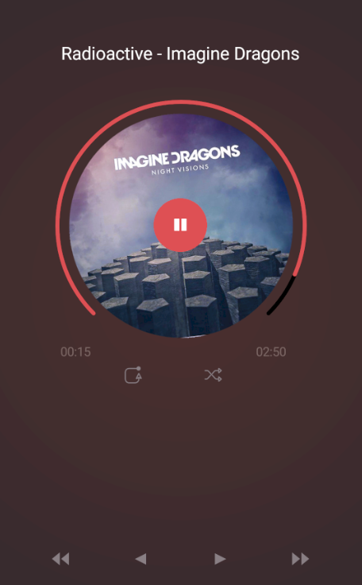
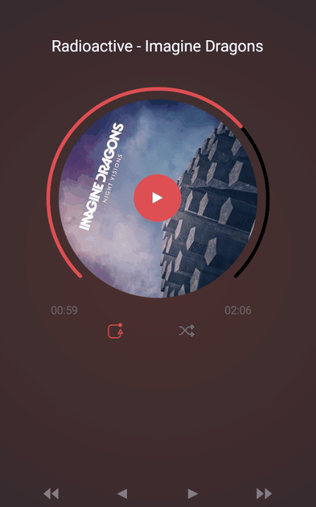

# Pulse Music

Pulse Music is a Xamarin.Forms sample to show how to create **goodlooking UI** with Xamarin.Forms. This sample is based on [Music Player App](https://dribbble.com/shots/1939991-Music-Player-App-WIP) designed by [Anish Chandran](https://dribbble.com/anish_chandran).

***NOTES**:The icons of the App are not exactly the same. Used similar icons taken from [Metro Studio](https://www.syncfusion.com/downloads/metrostudio).* 

*The main objective of the sample is to show the creation of the Player's UI (circular progress, rotating cover, etc.). This App is NOT a real player.*

## Xamarin.Forms App (Pulse Music)

**Xamarin.Forms** allows you to build native UIs for iOS, Android, Windows, Linux, macOS and Tizen from a single, shared codebase. This project exercises the following patterns and features:

- XAML UI
- Animations
- Converters
- Custom Controls
- Data Binding
- Messaging Center
- MVVM
- Plugins for Xamarin
- Styles
- SkiaSharp
- [.NET Standard 2.0](https://github.com/dotnet/standard)

## Supported Platforms: iOS and Android

The Pulse Music app is available for two platforms:

- iOS
- Android

## Screens

 

## Requirements

* [Visual Studio 2017 version 15.3 or Visual Studio for Mac version 7.3](https://www.visualstudio.com/vs/)

## Licenses

This project uses some third-party assets with a license that requires attribution:

- Google Fonts
- [SkiaSharp](https://www.nuget.org/packages/SkiaSharp)
- [FFImageLoading](https://github.com/daniel-luberda/FFImageLoading)
- [Plugins.Forms.ButtonCircle](https://github.com/wilsonvargas/ButtonCirclePlugin)

## Copyright and license

Code released under the [MIT license](https://opensource.org/licenses/MIT).